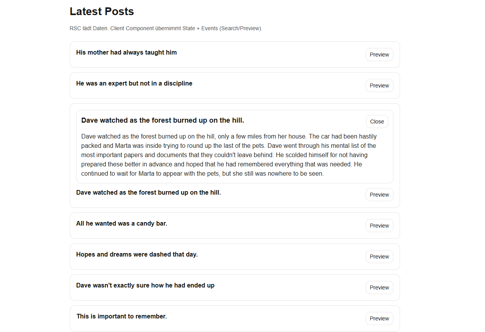

## Übung: Real-World RSC in Next.js (App Router)

npx create-next-app@latest uebung --ts --eslint --app --src-dir --import-alias "@/\*" --no-tailwind --turbopack

### Ziel

- Baue eine **Server Component (RSC)**, die Posts serverseitig lädt und rendert. Z.B. (https://dummyjson.com/posts?limit=8)
- Versuche danach **State + Events** hinzuzufügen (z. B. `useState`, `onClick`). Warum klappt das nicht?

## WEIL ES EINE SERVER KOMPONENTE IST

## 2) Füge State + Events hinzufügen

### Frage: Warum geht das nicht?

## 3) verwende RSC für Daten & Layout und Client Component für Interaktion

### Datenquelle und RSC

- Schreibe **RSC Page** um: `app/posts/page.tsx`
- Diese Page lädt serverseitig Daten über `fetch` (z. B. DummyJSON) und rendert:
  - Überschrift **"Latest Posts"**
  - Kurztext unter der Überschrift
  - Übergibt die geladenen `posts` als Props an eine Client Component

---

## UI-Anforderungen (ClientComponent)

- Zeige eine Liste von Karten (ein `li` pro Post)
- Jede Karten-Zeile hat:
  - links: Post-Title (kurz)
  - rechts: Button **"Preview"**

- **Wenn ein Post ausgewählt ist**, soll **direkt oberhalb des jeweiligen `li`-Contents** (also “inline” innerhalb desselben `li`) eine Vorschau-Box erscheinen:
  - Title (größer/kräftiger)
  - Body-Text
  - Button **"Close"** zum Schließen

## Interaktivität: `useState` mit `selectedId`

- Verwende **`useState`** mit folgender State-Variable:

```ts
const [selectedId, setSelectedId] = useState<number | null>(null);
```

- Logik:
  - Klick auf **Preview** setzt `selectedId` auf die `post.id`
  - Klick auf **Close** setzt `selectedId` auf `null`
  - Genau **eine** Vorschau ist gleichzeitig sichtbar (die mit `selectedId`)



### Schritt B: RSC ruft Client Component auf und gibt Daten rein

**Datei:** `app/posts/page.tsx` (RSC)

```tsx
// app/posts/page.tsx
import PostsClient from "./PostsClient";

type Post = {
  id: number;
  title: string;
  body: string;
  userId: number;
};

async function getLatestPosts(): Promise<Post[]> {
  const res = await fetch("https://dummyjson.com/posts?limit=8", {
    cache: "no-store",
  });

  if (!res.ok) {
    throw new Error("Failed to fetch posts");
  }

  const data: { posts: Post[] } = await res.json();
  return data.posts;
}

export default async function PostsPage() {
  const posts = await getLatestPosts();

  return (
    <main className="mx-auto max-w-[900px] p-6">
      <h1 className="mb-3 text-[28px] font-semibold">Latest Posts</h1>
      <p className="mb-6 text-sm text-neutral-600">
        RSC lädt Daten. Client Component übernimmt State + Events
        (Search/Preview).
      </p>

      <PostsClient posts={posts} />
    </main>
  );
}
```

---
